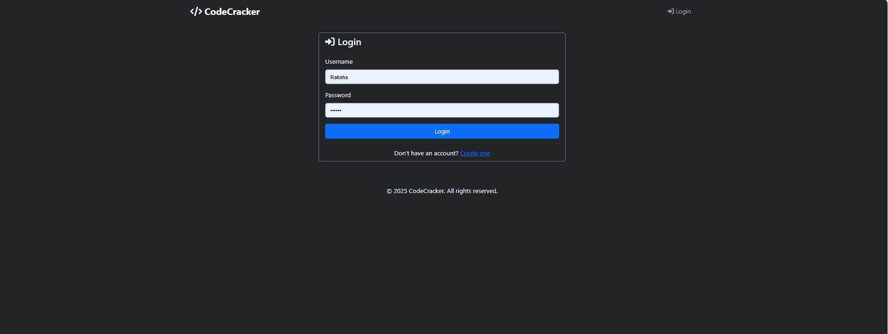
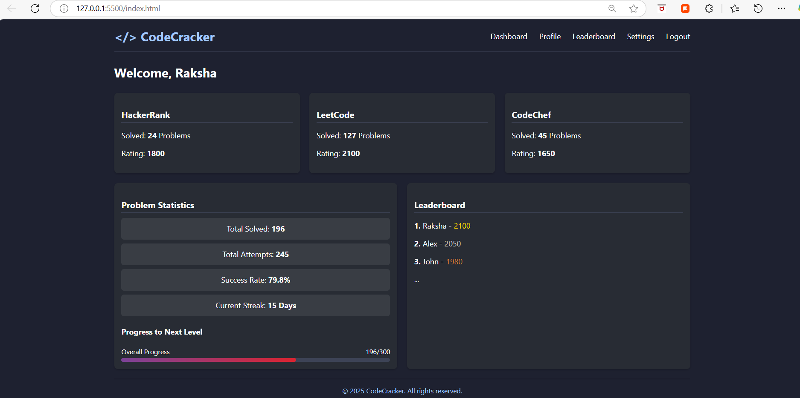

# CodeCracker: A Competitive Programming Tracker

📌 **Overview**  
CodeCracker is a web-based competitive programming tracker that fetches and visualizes user stats from platforms like Codeforces, LeetCode, and CodeChef using their APIs. It provides insights into problems solved, ratings, and progress trends, helping users analyze their competitive programming journey.

---

🚀 **Features**  
- **User Progress Tracking:** Fetches problems solved, ratings, and streaks from Codeforces, LeetCode, and CodeChef.  
- **Performance Analytics:** Visualizes user progress using interactive charts (Matplotlib/Chart.js).  
- **Leaderboard System:** Allows users to compare rankings with friends.  
- **Authentication System:** Enables user registration and login to save and track progress.  

---

🛠️ **Tech Stack**  
- **Frontend:** HTML, CSS, JavaScript (Chart.js)  
- **Backend:** Python (Flask/Django)  
- **Database:** SQLite (can integrate with PostgreSQL or MongoDB)  
- **APIs:** Codeforces, LeetCode, CodeChef API integration  

---

📂 **Project Structure**  
```
CodeCracker/
│-- data/                   # JSON files for user data storage
│   ├── user_123456.json
│   ├── user_8943138178562.json
│-- services/               # Backend services
│   ├── __init__.py
│   ├── api_service.py      # API handling logic
│   ├── user_service.py     # User data processing
│-- static/                 # Static files (CSS, JS)
│   ├── css/
│   │   ├── style.css
│   ├── js/
│   │   ├── chart.js
│-- templates/              # HTML templates
│   ├── base.html
│   ├── dashboard.html
│   ├── login.html
│   ├── profile.html
│   ├── register.html
│-- app.py                  # Main Flask application
│-- config.py               # Configuration settings
│-- requirements.txt        # Dependencies
│-- README.md               # Project documentation
```

---

🔧 **Installation & Setup**  
### **Prerequisites**  
- Python (>= 3.8)  
- Git  
- Virtual Environment (optional but recommended)  

### **Steps**  
1. **Clone the Repository**  
```sh
git clone https://github.com/RakshaShetty/CodeCracker.git
cd CodeCracker
```

2. **Create Virtual Environment (Optional but Recommended)**  
```sh
python -m venv venv
source venv/bin/activate  # On Windows use: venv\Scripts\activate
```

3. **Install Dependencies**  
```sh
pip install -r requirements.txt
```

4. **Run the Application**  
```sh
python app.py
```

5. **Access the Web App**  
Open your browser and go to:  
```
http://127.0.0.1:5000/
```

---

🎯 **Usage**  
1. **Sign up and log in to your account.**
2. **Add your handles from HackerRank, LeetCode, and CodeChef to track your progress.**
3. **View your problem-solving stats, including the number of problems solved and progress over the week.**
4. **Monitor your daily problem-solving progress using a bar chart.**

---

📸 **Screenshots**  
### Dashboard View  


### Register View 

 
### Dashboard View 

 
---

🛡️ **Future Improvements**  
- Add support for more competitive programming platforms.  
- Improve data visualization with interactive graphs.  
- Implement AI-based performance suggestions.  
- Mobile-friendly responsive design.  

---

🤝 **Contributing**  
Contributions are welcome! Feel free to fork the repo, create a new branch, and submit a PR.  

---

📄 **License**  
This project is licensed under the MIT License.  

---

📞 **Contact**  
For any queries or suggestions, reach out to:  
- **Email:** raksharshetty46gmail.com  
- **GitHub:** [rakshashetty66](https://github.com/rakshashetty66)  

---

🚀 **Track your progress and improve your competitive programming skills with CodeCracker!**
